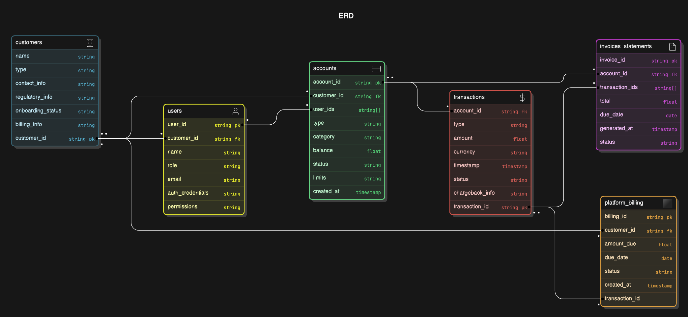
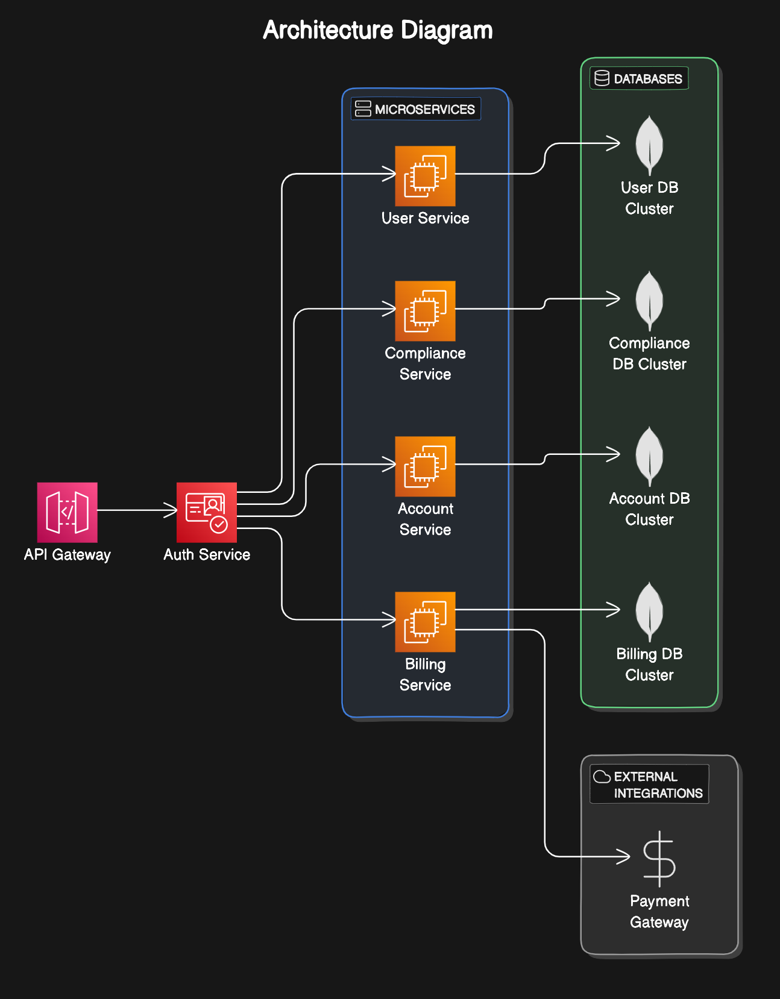

## Part One

  **Collections**:

- **Customers (FinTechs, Banks)**:

- Fields: customer_id, name, type, contact_info, regulatory_info, onboarding_status, billing_info.
- Relationships: Can have multiple users and accounts.

- **Users**:

- Fields: user_id, customer_id, name, role, email, auth_credentials, permissions.
- Relationships: Linked to accounts, can send/receive transactions.

- **Accounts**:

- Fields: account_id, customer_id, user_ids[], type (Personal, Business, Corporate), category (Current, Savings, Foreign Currency), balance, status, limits, created_at.
- Relationships: Linked to users and transactions.

- **Transactions**:

- Fields: transaction_id, account_id, type (credit, debit), amount, currency, timestamp, status, chargeback_info.
- Relationships: Linked to accounts, related to invoice or statement generation.

- **Invoices/Statements**:

- Fields: invoice_id, account_id, transaction_ids[], total, due_date, generated_at, status.
- Relationships: Linked to accounts and transactions.

- **Platform Billing**:

- Fields: billing_id, customer_id, amount_due, due_date, status, created_at.
- Relationships: Linked to customers and transactions.

**Normalization/Denormalization Strategies**:

- **De-normalization**: Since MongoDB is a NoSQL database, a slight de-normalization can be allowed for performance, such as embedding user info in accounts or transactions. For example:
- Embed user roles and permissions in accounts for quicker authorization checks.
- Store summary-level transaction data in accounts for faster balance lookup.

- **Normalization**: Maintain separate collections for reusable data (e.g., customer info, users) and link by IDs.

**Financial Regulation Compliance**:

- **GDPR**: Ensure collections have proper fields to manage customer consent, data deletion requests, and audit trails.
- **PCI DSS**: Encrypt sensitive data (e.g., account numbers, user credentials) and store only tokens or references for transactions.
- **Audit Logs**: Maintain an audit_log collection that records every modification to critical collections, including timestamps and user actions.

**ACID Compliance in MongoDB**:

- MongoDB provides multi-document transactions starting from version 4.0, which allows you to ensure that financial transactions (credits and debits) are processed reliably.
- **Transaction example**:

- Begin transaction when creating or reversing a transaction.
- Ensure updates to both accounts (creditor and debtor) are committed atomically.
- Use MongoDB’s session object to manage transaction lifecycle.

  
**ER Diagram Example:**

- **Customers → Users → Accounts → Transactions → Invoices/Statements**.

This shows the hierarchical relationship between entities, with primary and foreign keys linking them.

  

## Part Two

**Architecture Type:**

- **Microservices**:

- **Justification**: Micro services enable decoupling of services like user management, account management, transaction processing, and compliance reporting. This leads to easier scalability, independent deployment, and maintenance of each service.
- **Example Services**:

- User service (handles user creation, authentication, roles).
- Account service (creates, manages accounts and transactions).
- Billing service (manages platform and customer billing).
- Compliance service (handles regulatory reporting, transaction audits).

  

**Architecture Diagram:**

- **Components**:

- API Gateway → Auth Service → Microservices (User, Account, Billing, Compliance).
- MongoDB clusters for each service (with appropriate sharding/replication).
- External integration via APIs (e.g., payment gateways).

  **Handling High Traffic and Security:**

- **Scalability**: Use horizontal scaling with Kubernetes to scale microservices independently based on load.
- **Security**: Implement secure communication using TLS for data in transit, encrypt sensitive data at rest using field-level encryption in MongoDB. Use OAuth2/JWT for authentication and role-based access control (RBAC).
- **API Rate Limiting**: Use API Gateway with rate limiting and throttling to prevent abuse.

**Audit Logs and Usage Statistics:**

- **Audit Logs**: Maintain audit log services that track every API interaction, changes to critical data, and transactions. Store in separate, immutable collections in MongoDB.
- **Usage Statistics**: Collect metrics like API usage, transaction volume, errors, and latency using a centralized logging service like ELK Stack or Prometheus/Grafana.

## Part Three

**Potential Loopholes:**

1. **Compliance Reporting**: Lacking built-in support for automatic reporting to financial regulators (AML, GDPR compliance).

- **Enhancement**: Create real-time reporting dashboards and scheduled exports of compliance data.

3. **AI-Driven Fraud Detection**:

- Missing AI-driven anomaly detection for fraudulent transactions (e.g., unusual transaction amounts or patterns).
- **Enhancement**: Implement machine learning models for real-time fraud detection based on transaction history and user behavior.

5. **Customer Support Module**:

- No clear definition of how customer support is handled (e.g., resolving disputes or providing assistance).
- **Enhancement**: Introduce an automated ticketing system and support chatbots for FinTechs and end users.

7. **Real-time Data Processing**:

- Missing real-time transaction processing for high-frequency accounts (e.g., stock trading).
- **Enhancement**: Integrate Kafka or RabbitMQ for handling high-velocity transactions and real-time updates.

9. **API Rate Limiting and Throttling**:

- Lacking a strategy to protect the system from abusive API calls or malicious actors.
- **Enhancement**: Use advanced rate limiting strategies like adaptive throttling based on historical usage.

  
## Summary

**Scalability:**

- **Microservices** : Independent scaling of services based on traffic.
- **MongoDB Sharding**: Horizontal sharding ensures scalability for large datasets.

**Redundancy:**

- **MongoDB Replication**: Ensure high availability with replica sets.
- **Failover Strategies**: Use Kubernetes to manage failover and recovery of services.

**Security:**

- **PCI DSS Compliance**: Encrypt sensitive data in MongoDB and use secure communication.
- **RBAC**: Role-based access for different user types ensures secure access.

**Performance:**

- **Optimized Queries**: Proper use of indexes and aggregations in MongoDB to improve read/write speeds.
- **Caching**: Use Redis for caching frequently accessed data like user permissions or account balances.

This design ensures a robust, scalable, and secure backend system for a BAAS platform while adhering to MongoDB’s ACID transactions and compliance requirements.
